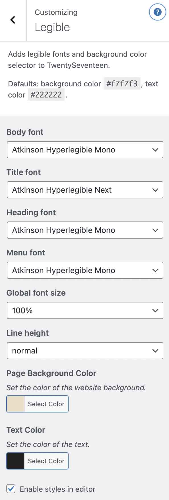

# ODAM Legible 2017

[](https://github.com/xxsimoxx/legible-2017/actions/workflows/codacy.yml)
[](https://github.com/xxsimoxx/legible-2017/actions/workflows/cpcs.yml)

## Adds a menu in Customizer to make the site more legible with TwentySeventeen theme.
- Legible fonts selector
- Font size selector
- Font color picker
- Line height selector
- Background color picker

The plugin is intended to make the site more accessible to people with reduced vision or dyslexia.

## Supported themes
- Twenty Seventeen
- ClassicPress TwentySeventeen
- The ClassicPress Theme
*Please report other themes where this plugin works.*

## Fonts
The plugin uses 4 Google Fonts: *Atkinson Hyperlegible*, *Atkinson Hyperlegible Next*, *Atkinson Hyperlegible Mono* and *Lexend Deca*.
You can add your preferred fonts using a filter linke this:
```php
add_filter( 'legible_2017_fonts' , function( $list ) {
	$list[] = 'Roboto';
	return $list;
});
```

## Editor
Fonts and colors can also be used in the editor. This feature can be enabled in the Customizer or using a filter:
```php
add_filter( 'legible_2017_editor' , '__return_true' );
```

## Loading font locally
This plugin works well with [Local Google Fonts](https://wordpress.org/plugins/local-google-fonts/) plugin.

## Credits
- This plugin was originally forked from [Customize Twenty Seventeen](https://wordpress.org/plugins/customize-twenty-seventeen/) by [BOLDThemes](https://bold-themes.com/).
- *ODAM* is the name of the site for which this plugin was designed. Thanks to my client Elisa Botton.

## Screenshots

